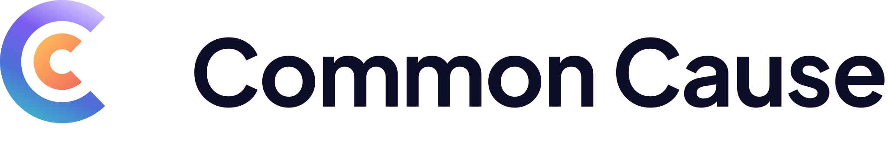

<picture>
  <source media="(prefers-color-scheme: dark)" srcset="../.github/brand/commoncause-lockup-horizontal-white.svg">
  
</picture>

  

<em>You don’t have to hold it alone.</em>

 

  

**[Contributing](https://github.com/CommonCauseGroup/.github/blob/main/CONTRIBUTING.md)** ·
**[Code of conduct](https://github.com/CommonCauseGroup/.github/blob/main/CODE_OF_CONDUCT.md)** ·
**[Security](https://github.com/CommonCauseGroup/.github/blob/main/SECURITY.md)** ·
**[Support](https://github.com/CommonCauseGroup/.github/blob/main/SUPPORT.md)** ·
**[Repositories](https://github.com/orgs/CommonCauseGroup/repositories)**

---

Common Cause builds software for mental health care — the account somebody signs
in with, the console a clinic administers itself from, the API a partner
integrates against. This is the organisation's public work: the parts of that
estate we can share, and the place to talk to us about them.

 

> [!CAUTION]
> ### If you need help right now
>
> **This is a code repository, and nobody is reading it for a crisis.** Issues
> can sit for days, and everything filed here is public and permanent.
>
> If you are in immediate danger, call **999** (UK) or your local emergency
> number. To talk to somebody any hour of any day, **Samaritans** are on
> **116 123** — free, from any phone. Outside the UK,
> **[findahelpline.com](https://findahelpline.com)** will find the equivalent
> where you are.
>
> If you use one of our products and something is wrong with your account, that
> route is **[SUPPORT.md](https://github.com/CommonCauseGroup/.github/blob/main/SUPPORT.md)** — not an issue here.

 

## What we build

<table>
<tr>
<td width="50%" valign="top">

### 🔑 Account
One sign-in across everything Common Cause runs, and the place a person controls
their own details, devices and sessions.

</td>
<td width="50%" valign="top">

### ☁️ Cloud
The catalogue of what we offer, the projects a partner organises their
integration into, the API credentials that come out of it, and the usage they
are billed on.

</td>
</tr>
<tr>
<td valign="top">

### 🏢 Manage
The console a customer organisation runs itself from — its people, its org
units, its licences and its administrators.

</td>
<td valign="top">

### 📣 Adverts
Campaigns, creatives, and review. Every advert seen by a person is looked at by
a person first.

</td>
</tr>
<tr>
<td colspan="2" valign="top">

### 🔌 Console
The estate's public API. One host, one key, and the products a project has
enabled — no `/api`, each product under its own prefix, and every call metered
so a project can see exactly what it used.

</td>
</tr>
</table>

Two of those — **Sign in with Common Cause**, and the product APIs behind
**Console** — are things you can build against today. Cloud's documentation is
the starting point, and an API key is minted from the console once a project has
the product enabled.

 

## Where the code is

**[Browse all our repositories →](https://github.com/orgs/CommonCauseGroup/repositories)**

Some are public and some are not. Each carries its own `README.md`, and that is
the authority on how to run it and how to test it; a repository with its own
`CONTRIBUTING.md`, `SECURITY.md` or `LICENSE` overrides the organisation
defaults you are reading here.

> [!IMPORTANT]
> **The licence differs between our repositories, and not all of them are open
> source.** Check the `LICENSE` file of the repository you are contributing to
> before you start — [Contributing](https://github.com/CommonCauseGroup/.github/blob/main/CONTRIBUTING.md#sending-it)
> explains what you are agreeing to when you open a pull request.

 

## Working with us here

| | |
| --- | --- |
| 🤝 **[Contributing](https://github.com/CommonCauseGroup/.github/blob/main/CONTRIBUTING.md)** | How a change gets from your machine into ours: the conventions, the review, and the things we will ask you to change. |
| 💬 **[Code of conduct](https://github.com/CommonCauseGroup/.github/blob/main/CODE_OF_CONDUCT.md)** | The short version is that people come here to build something for people having a hard time, and we behave accordingly. |
| 🔐 **[Security](https://github.com/CommonCauseGroup/.github/blob/main/SECURITY.md)** | How to report a vulnerability privately, what we promise back, and what is in scope. |
| 🧭 **[Support](https://github.com/CommonCauseGroup/.github/blob/main/SUPPORT.md)** | Which door to knock on, for each kind of problem. |

New here and looking for somewhere to start: issues labelled
**`good first issue`** are ones we have checked can be finished by somebody who
has not seen the codebase before, and **`help wanted`** are ones we would
genuinely rather not do alone.

 

## Two things about our code that surprise people

**Everything is written in British English and person-first language**, in the
code as well as the interface — `organisation`, `licence`, `colour`. A variable
named `suicides_committed` will be sent back in review, and so will a comment
that calls somebody a service user. The words we use about people leak out of
the codebase eventually.

**We do not log what we do not need.** Analytics, third-party fonts, error
trackers that capture request bodies — each of those is a question with a high
bar, because the fact that somebody loaded one of our pages is itself
information about them. If a change adds a network call to a domain we do not
own, say so in the pull request; it is the first thing review will ask about.

---

<b>Common Cause</b> · care, and the software under it

